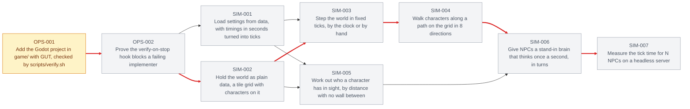

# Task graph

Generated by `scripts/plan.mjs graph` — do not edit by hand.

Legend: green = done, blue = in progress, purple = review, yellow = ready, gray = blocked, red edges = critical path.

```mermaid
flowchart LR
  OPS_001["OPS-001<br/>Add the Godot project in game/ with GUT, checked by scripts/verify.sh"]:::ready
  OPS_002["OPS-002<br/>Prove the verify-on-stop hook blocks a failing implementer"]:::blocked
  SIM_001["SIM-001<br/>Load settings from data, with timings in seconds turned into ticks"]:::blocked
  SIM_002["SIM-002<br/>Hold the world as plain data, a tile grid with characters on it"]:::blocked
  SIM_003["SIM-003<br/>Step the world in fixed ticks, by the clock or by hand"]:::blocked
  SIM_004["SIM-004<br/>Walk characters along a path on the grid in 8 directions"]:::blocked
  SIM_005["SIM-005<br/>Work out who a character has in sight, by distance with no wall between"]:::blocked
  SIM_006["SIM-006<br/>Give NPCs a stand-in brain that thinks once a second, in turns"]:::blocked
  SIM_007["SIM-007<br/>Measure the tick time for N NPCs on a headless server"]:::blocked
  OPS_001 --> OPS_002
  OPS_002 --> SIM_001
  OPS_002 --> SIM_002
  SIM_001 --> SIM_003
  SIM_002 --> SIM_003
  SIM_003 --> SIM_004
  SIM_001 --> SIM_005
  SIM_002 --> SIM_005
  SIM_004 --> SIM_006
  SIM_005 --> SIM_006
  SIM_006 --> SIM_007
  classDef done fill:#d1fae5,stroke:#059669,color:#064e3b
  classDef in_progress fill:#dbeafe,stroke:#2563eb,color:#1e3a8a
  classDef review fill:#ede9fe,stroke:#7c3aed,color:#4c1d95
  classDef ready fill:#fef3c7,stroke:#d97706,color:#78350f
  classDef blocked fill:#f3f4f6,stroke:#9ca3af,color:#4b5563
  classDef needs_human fill:#fee2e2,stroke:#dc2626,color:#7f1d1d
  linkStyle 0,2,4,5,8,10 stroke:#dc2626,stroke-width:3px
```
